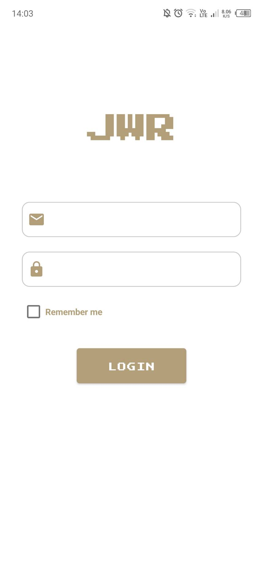
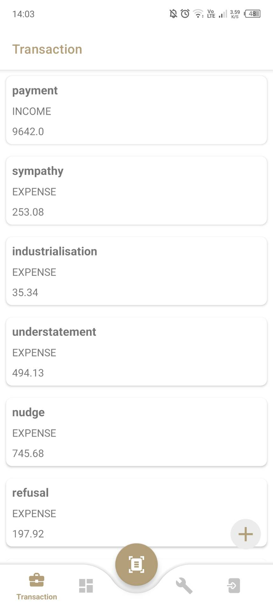
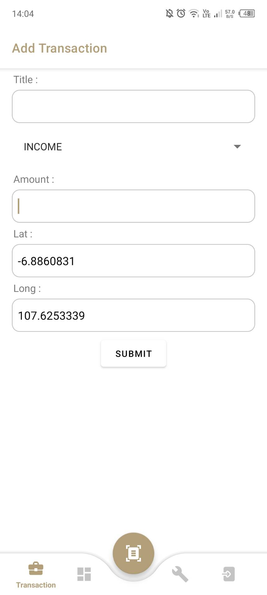
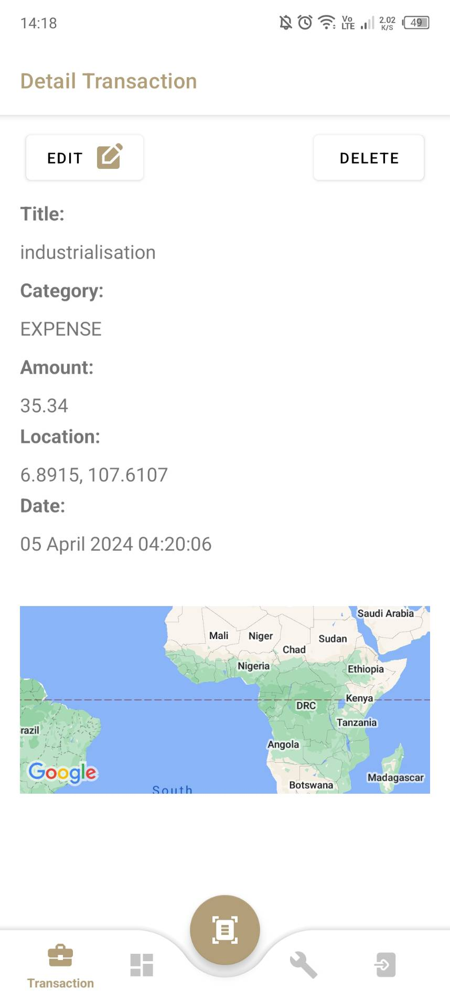
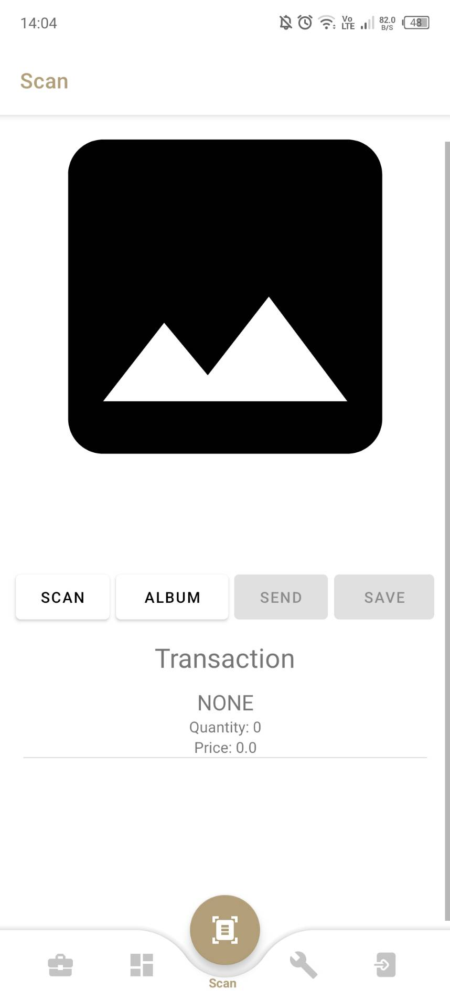
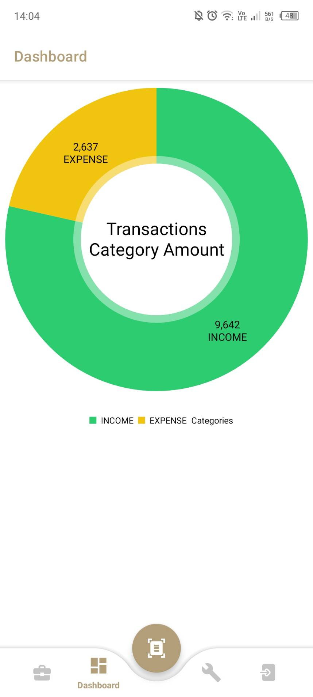
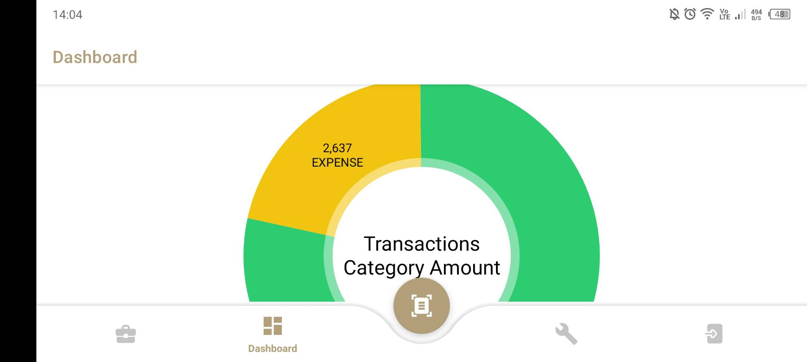
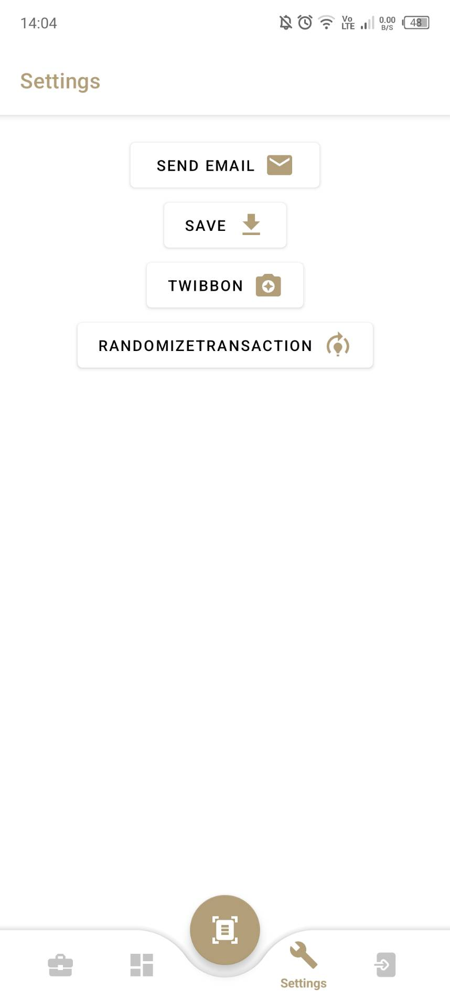
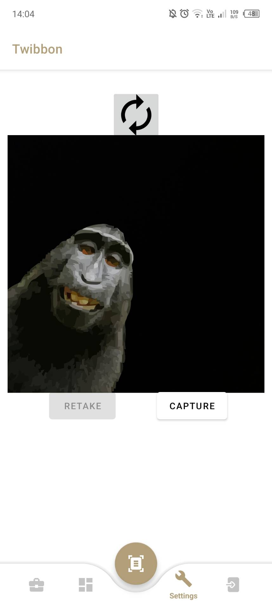

# IF3210-2024-Android-JWR

BondoMan adalah aplikasi manajemen keuangan berbasis Android.
Melalui aplikasi ini, pengguna dapat melakukan berbagai operasi terkait transaksi keuangan, seperti menambahkan, mengubah, dan menghapus entri transaksi.
Selain itu, BondoMan menawarkan fitur unik dimana pengguna bisa menambahkan transaksi dengan cara memindai nota.
Aplikasi ini juga dilengkapi dengan dashboard yang menampilkan chart untuk memberikan visualisasi transaksi.
Pengguna juga dapat mengunduh daftar transaksi dalam bentuk spreadsheet dan mengirimkannya melalui Gmail.
Sebagai tambahan, BondoMan menyediakan fitur menarik lainnya yaitu kemampuan untuk mengambil foto twibbon langsung dari aplikasi.

## External Libraries

- [OkHttp](https://mvnrepository.com/artifact/com.squareup.okhttp3/okhttp)
- [MPAndroidChart](https://github.com/PhilJay/MPAndroidChart)
- [Apache POI](https://poi.apache.org)
- [Google Location Services](https://www.android.com/gms/)

## Screenshots

#### Splash Screen

#### Login Page

#### Transactions Page

  

  

#### Scan Page

#### Dashboard Page

 
 

#### Settings Page

#### Twibbon Page

## Team Members

<table>
  <tr>
    <th>NIM</th>
    <th>Nama</th>
    <th>Tugas</th>
    <th>Waktu Dedikasi</th>
  </tr>
  <tr>
    <td>13521081</td>
    <td>Bagas Aryo Seto</td>
    <td>
      - Scan nota 
      - Graf rangkuman transaksi 
      - Menyimpan daftar transaksi 
      - Twibbon
    </td>
    <td>40 jam</td>
  </tr>
  <tr>
    <td>13521103</td>
    <td>Aulia Mey Diva Annandya</td>
    <td>
      - CRUD transaksi 
      - Broadcast Receiver
    </td>
    <td>40 jam</td>
  </tr>
  <tr>
    <td>13521104</td>
    <td>Muhammad Zaydan Athallah</td>
    <td>
        - Header dan navbar 
        - Login 
        - Logout 
        - Intent Gmail 
        - Background Services 
        - Network Sensing
    </td>
    <td>40 jam</td>
  </tr>
</table>
